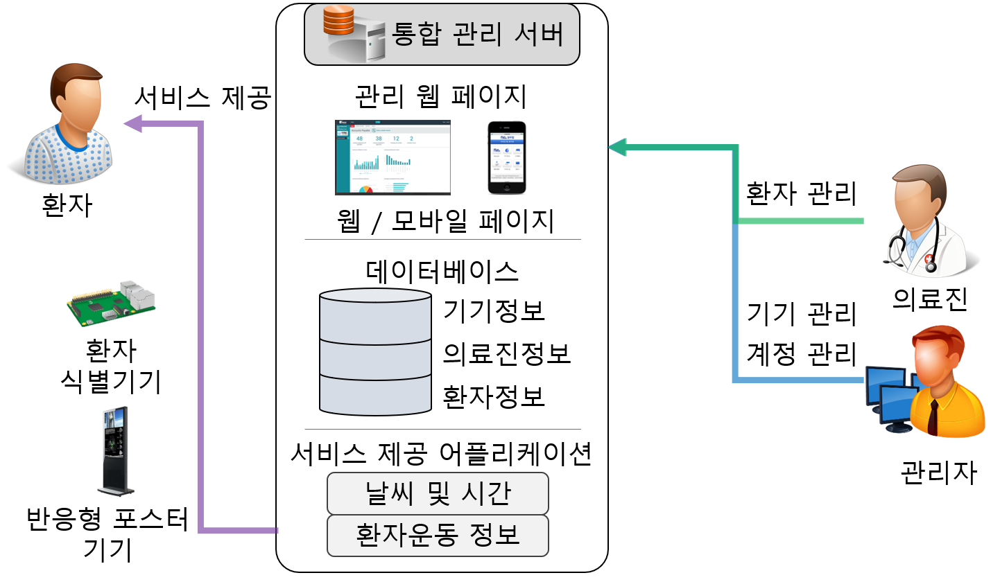

서버 프로그래밍 - 기말 프로젝트
==============================
<스마트 IoT기기를 이용한 반응형 환자 운동 보조 시스템>  
----------------------------------------------------
 본 시스템은 병원 내의 환경에서 환자의 운동 보조를 위한 스마트 IoT 반응형 환자 운동 보조 서비스를 개발하기 위한 시스템이다. 주된 사용자는 환자와 의료진이며, 관리자는 환자 운동 보조 서비스(이하 운동 서비스)를 제공할 기기를 관리하고 의료진의 계정을 관리한다. 환자는 환자 식별 기기(이하 식별기기)와 반응형 포스터 기기(이하 포스터 기기)를 통해 서비스를 제공받고, 의료진은 환자의 정보를 관리하는 동시에 환자에게 적합한 운동 프로그램을 지정하여 환자가 자율적으로 운동을 할 수 있게 도와준다.
  
  
 # 개발
 
+ 통합 관리 서버
>  통합 관리 서버는 관리 웹 페이지, 데이터베이스, 서비스 제공 어플리케이션으로 구성되어있다. 관리 웹 페이지는 의료진이나 관리자가 업무를 수행할 때에 사용하는 웹 페이지이며 이를 이용하여 데이터베이스를 수정할 수 있다. 데이터베이스는 기기 정보, 환자 정보, 의료진 정보를 담고 있으며 서비스 제공이나 계정 관리에 사용한다. 서비스 제공 어플리케이션은 환자에게 제공할 서비스를 담당하며 환자에게 운동 서비스를 제공한다.

+ 환자식별기기
>  환자 식별기기는 개통 시 환자에게 지급되며 환자를 식별할 수 있는 정보(환자 번호, 기기 식별 번호)를 담고 있다. 평소에는 환자의 움직임을 측정하여 환자의 운동량을 체크하고, 포스터 기기에 접근했을 시 포스터 기기와 연동하여 환자를 식별할 정보를 제공하고 지금까지의 운동량을 포스터 기기로 전송한다.

+ 반응형 포스터 기기
>  반응형 포스터 기기는 병원 복도에 설치되며 현재 시간, 기온 등의 정보를 화면에 표시함으로써 평소에는 정보 키오스크의 역할을 한다. 환자의 접근 시 환자 식별 기기와 연동하여 환자를 식별하고 환자가 운동을 수행할 수 있도록 유도한다. 환자에게는 개별적인 운동에 대한 정보와 방법을 전달하며 동시에 식별기기로부터 전송받은 운동량 데이터를 서버에 전송한다.
